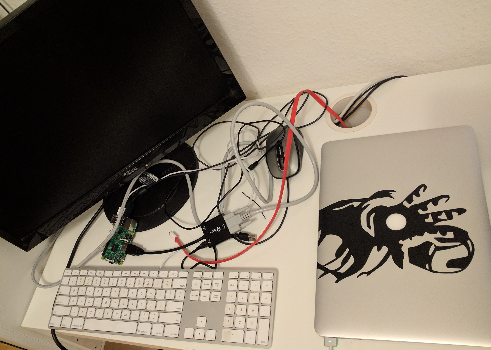
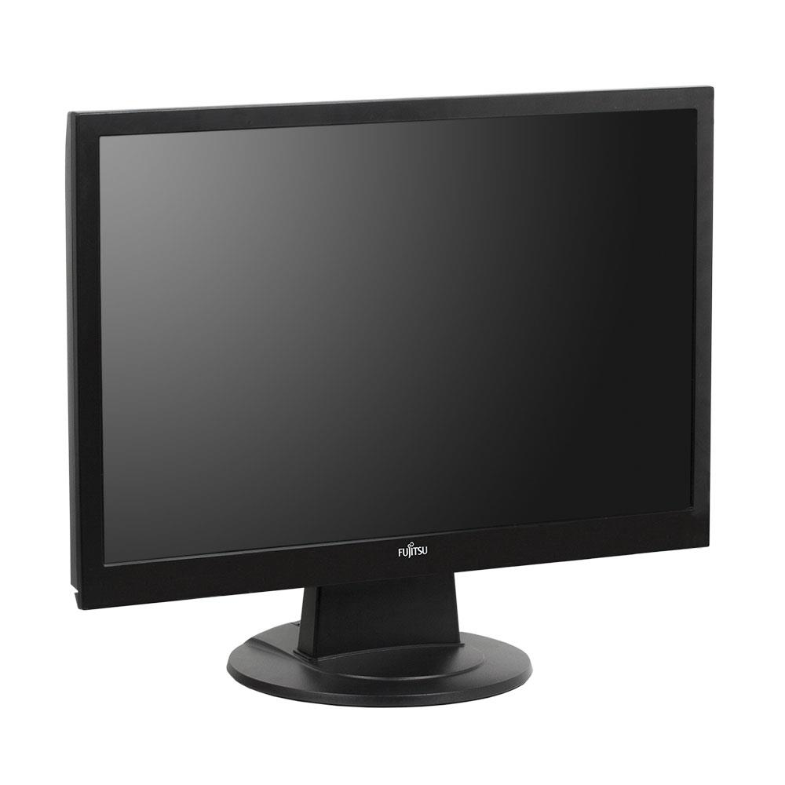
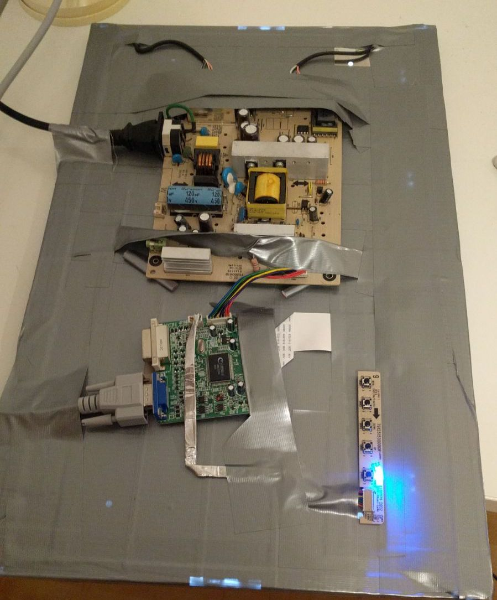
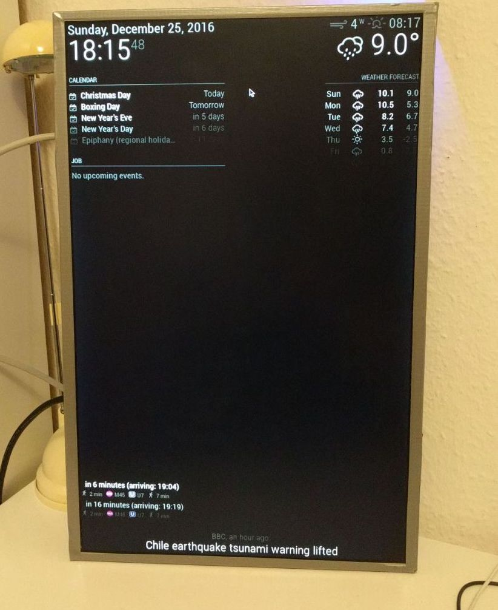
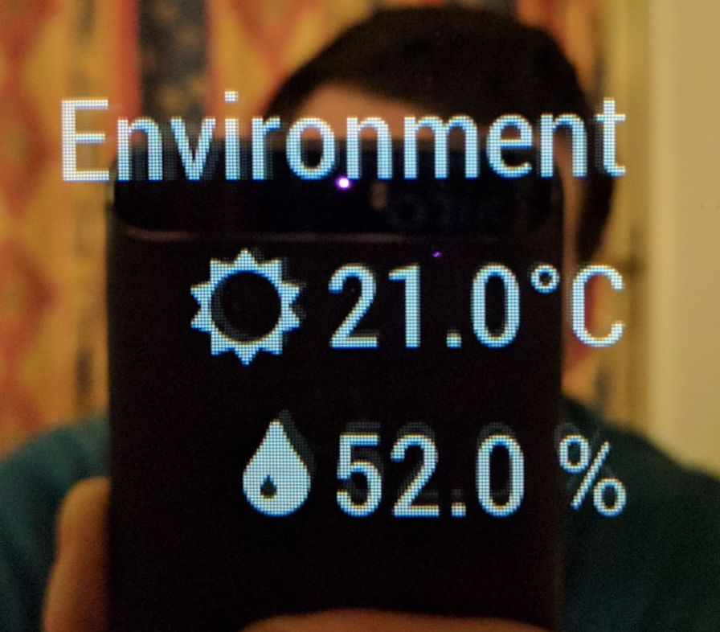
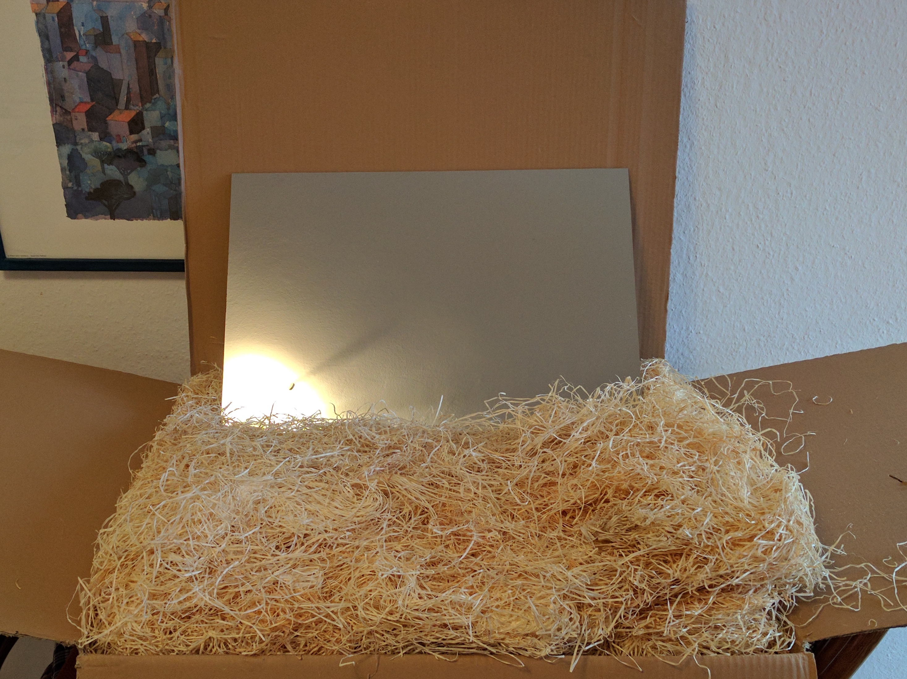
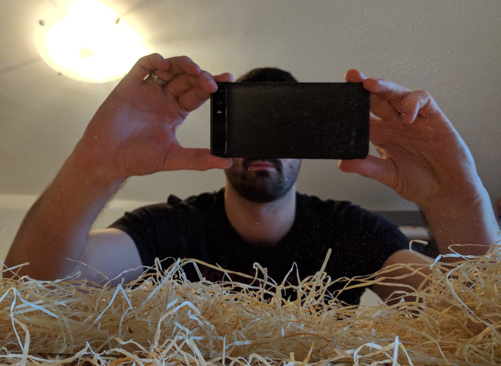
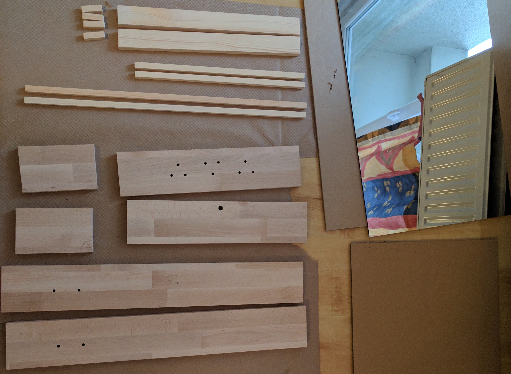
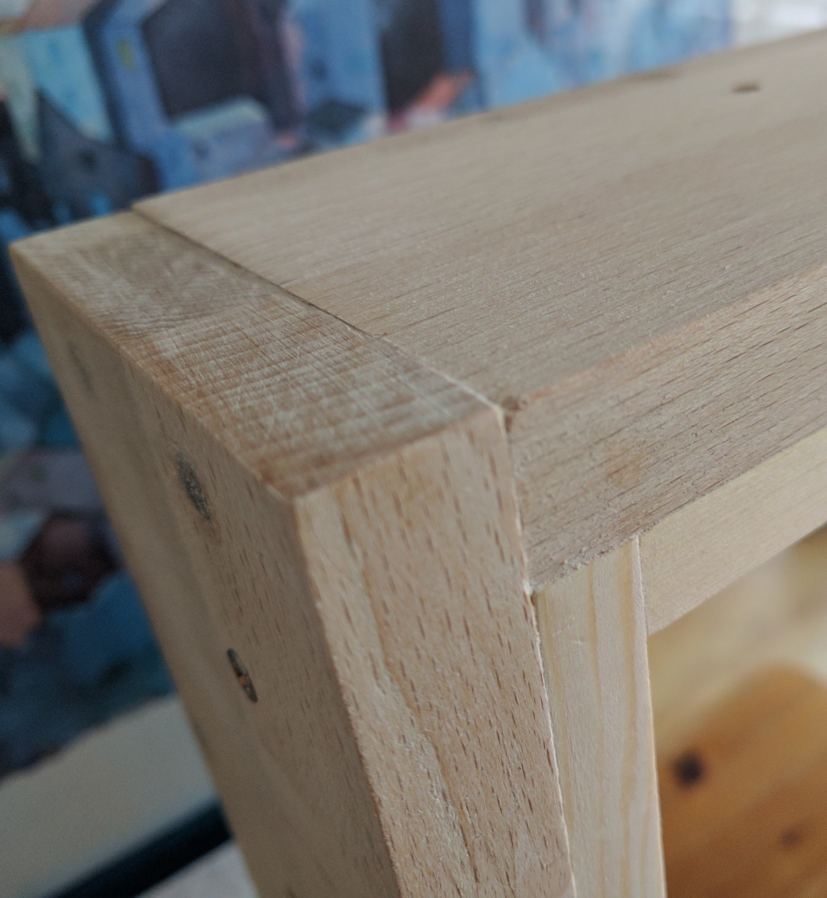
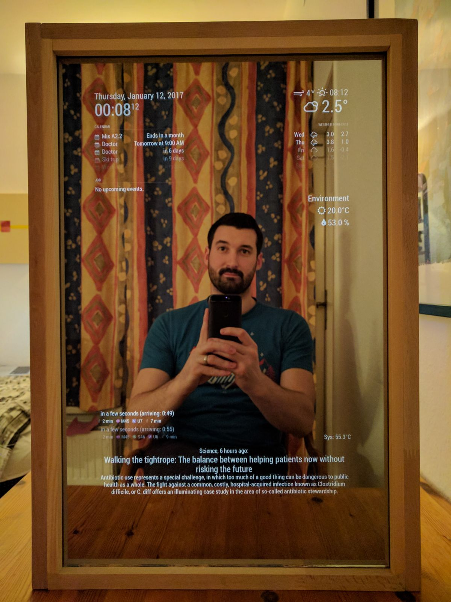

# smart-mirror (work in progress)

##Intro
Couple of months ago I've seen this Magic mirror project somewhere on Youtube. I've really liked the idea and it got me really interested in building my own. It would include some programing, hardware, wood working... So I decided to build it.

##Hardware

I bought/collected/borrowed the folowing things and started working.

1. [Raspberry Pi 3 Model B](https://www.raspberrypi.org/products/raspberry-pi-3-model-b/)
2. Keyboard
3. Mouse
4. Screen (an old VGA one)
5. [HDMI 2 VGA adapter](https://www.amazon.de/gp/product/B00ZMV7RL2/ref=oh_aui_detailpage_o01_s00?ie=UTF8&psc=1)
6. [DHT11 sensor](https://www.adafruit.com/product/386)

###Screen 

Got an old screen and striped it to bare bones. Newer monitor would be better and there would be no need for HDMI2VGA adapter but this was easy and cheap.

Also I taped it with ductupe just for good measure (and to hold all components together). Later I reused the metal holder because it just simplified everything.

##Software

This was the easiest thing. There is an awesome [Magic Mirror library](https://github.com/MichMich/MagicMirror) that gives you everything to start with to build your own Smart/Magic/Awesome Mirror.

There is also a lot of modules that can be installed and shown on the screen. All about different modules that other people built can be found [here](https://github.com/MichMich/MagicMirror/wiki/MagicMirror%C2%B2-Modules#3rd-party-modules).

After some fiddling with configurations and Github repos for different modules and trying different setups this was the first satisfactory result.

### Temperature and humidity monitoring

I used [DHT11 sensor](https://www.adafruit.com/product/386) to monitor environmental (in the apartment :)) temperature and humidity.

Steps:

1. Found the sensor on Amazon
2. [Tutorial](http://www.circuitbasics.com/how-to-set-up-the-dht11-humidity-sensor-on-the-raspberry-pi) on how to connect everything properly.
3. Implemented [my own module](https://github.com/bernardpletikosa/MMM-DHT-Sensor) for [Magic Mirror library](https://github.com/MichMich/MagicMirror) to show the data.

##Glass

This also proved to be chalenging. For this project you need 'two way mirror' or otherwise called 'spy glass'. It can be a bit hard to find and it's very expensive.

I needed 40x60 cm glass because my screen was 31x50 cm and I wanted the mirror to be a bit bigger that that.

I live in Berlin and had couple of options to choose from. They were all equaly expensive and everything seemed quite similar expect the thickness so I choose the smallest one of 4 mm that could be delivered reasonably fast and paid for it 60€.

###Issues
The glass is nice and light and very reflective. 
However the problem is transparency from the other side. It definitelly is transparent but also darkens the screen quite a bit. I need to take in account that my screen is old and not very bright but this was a bit of setback.
I need to play a bit more with different birghtnesses and settings to get the best of it.

##Frame

This was the fun part - I had almost no tools. I bought a hand saw and borrowed a drill from a friend. These were all the tools that I used and everything came out quite nice. 
So this shouldn't be a reason not to build it on your own. 

Even if you have no experience, with some planing, meassuring things 5 times before cutting - everything will work out great.

Also, some elbow grease, glue and screws helps a lot.

I was really happy with how it turned out.

##Final product

After tweeking the CSS and screen brightness this is what I've ended up with. Prety happy with the result I must say.

## TO DO

* Cable management
* Add PIR sensor
* Improve [MMM DHT widget](https://github.com/bernardpletikosa/MMM-DHT-Sensor)